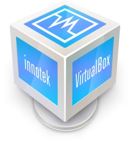
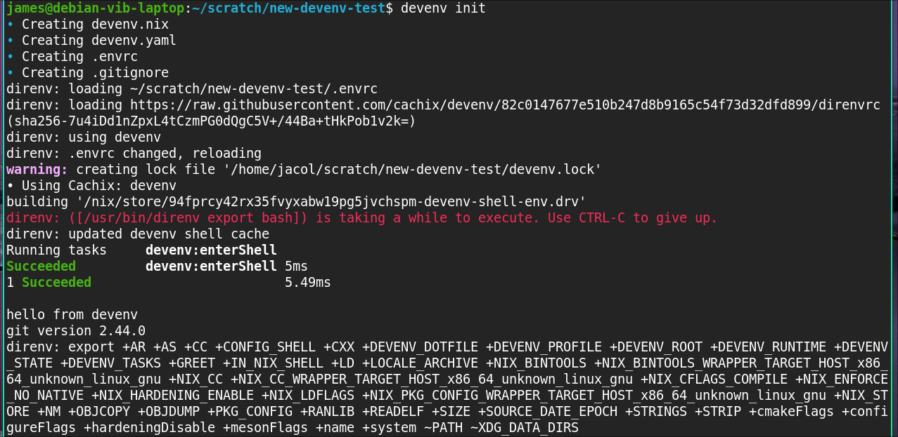

<!--
author: James Collier
email: james.collier@vib.be
language: en

font: Noto Sans Egyptian Hieroglyphs, Noto Sans Ogham
-->

# Easy reproducible development environments

> Or, how do I get the tools I need for the projects I'm working on without these tools conflicting between projects?


## A typical project

 {{0}}
A web application with 3 components:

1. An API server written in Python
2. A Typescript UI running in a web browser
3. A CLI interface written in Rust

 {{1}}
To work on any of these components I at least need:

{{2}} Git

{{3}} A programming text editor (e.g. Emacs, Zed, Neovim)

{{4}} But also a lot more...

## The API Server

* A Python LSP (e.g. `pylsp`)
* A database (e.g. Postgres or sqlite)
* And a way of giving the API server the database connection information
* Python and dependencies as defined in `pyproject.yml` or `requirements.txt`
* Formatter, linter, typechecker (e.g. `ruff`, `black`, `pylint`, `mypy` for Python)

## The client UI

* A Typescript LSP (e.g. `typescript-language-server`)
* Node.js + NPM
* Dependencies defined in `package.json`
* Formatter, linter, typechecker (e.g. `eslint`, `prettier`, and `Typescript`)
* I also need to know the development server URL

## The CLI

* Rust LSP (e.g. `rust-analyzer`)
* Rust compiler and package manager
* Dependencies defined in `Cargo.toml`
* Formatter, linter (e.g. `clippy` and `rustfmt`)

## What's the problem?

{{0}} My projects use different versions of a tool

{{1}} I haven't worked on this project in 2 years and the dependencies are no longer available

{{2}} I need to work on a project from a new machine

{{3}} What if my development laptop breaks?

{{4}} What if I need to onboard another developer?

## One of many...

{{0}}
Containers
==========


{{1}}
Virtual Machines 
================

{{2}}
Conda 
=====

{{3}}
Ansible 
=======

{{4}}
Guix  
====

{{5}}
Nix 
===

## Devenv


[devenv.sh](https://devenv.sh) is a wrapper around Nix specifically to
create reproducible development environments

* Packages work back in time

  The package might not be available in distribution repositories anymore, but it will be available through Nix

* Inspect the dependencies (not like a container image)

Activate with:
==============
```bash
devenv shell  # Activate the development environment
```

## Direnv

[Direnv.net](https://direnv.net)

Per directory shell profile
===========================

* Set environment variables when entering a directory

* Load secrets from a password manager into environment variables

* Set up environment for _Devenv_ in the current shell

## Demo
{{0}}
!?[Direnv activation](media/terminal-demo-opt.mp4)

{{1}}
!?[Inside an editor](media/emacs-demo-opt.mp4)

## Start with Devenv
{{0}}


{{1}}
```nix
{ pkgs, lib, config, inputs, ... }:
{
    packages = [ pkgs.git ];

    languages.python = {
        enable = true;
        version = 3.11.3;
        poetry.enable = true;
    };
}
```

## Run the app

```nix
{ pkgs, lib, config, inputs, ... }:
{
    packages = [ pkgs.git pkgs.entr ];

    languages.python = {
        enable = true;
        version = "3.11.3";
        poetry.enable = true;
    };

    tasks = {
        "ttfd:watch" = {
            exec = ''find -name *.py | entr -s "python src/main.py"'';
        };
    };
}
```

Run with:
=========
```bash
devenv tasks run ttfd:watch
```

## Run tests

```nix
{ pkgs, lib, config, inputs, ... }:
{
    packages = [ pkgs.git pkgs.entr ];

    languages.python = {
        enable = true;
        version = "3.11.3";
        poetry.enable = true;
    };

    tasks = {
        "ttfd:watch" = {
            exec = ''find -name *.py | entr -s "python sr/main.py"'';
        };
    };

    enterTest = ''
        python -m pytest
    '';
}
```

Run with:
=========
```bash
devenv test
```

## Services

```nix
{ pkgs, lib, config, inputs, ... }:
{
    packages = [ pkgs.git pkgs.entr ];

    languages.python = {
        enable = true;
        version = "3.11.3";
        poetry.enable = true;
    };

    tasks = {
        "ttfd:watch" = {
            exec = ''find -name *.py | entr -s "python src/main.py"'';
        };
    };

    enterTest = ''
        python -m pytest
    '';

    services.postgres = {
        enable = true;
        package = pkgs.postgresql_15;
        initialDatabases = [{ name = "ttfd"; }];
    };
}
```

Run with:
=========
```bash
devenv up
```

## Summary
{{0}}
**Devenv** and **Direnv** are powerful tools with a lot of promise.

{{1}}
Has some advantages over alternatives

{{2}}
Has some disadvantages

{{3}}
Worth considering even for existing projects

## Community Session

